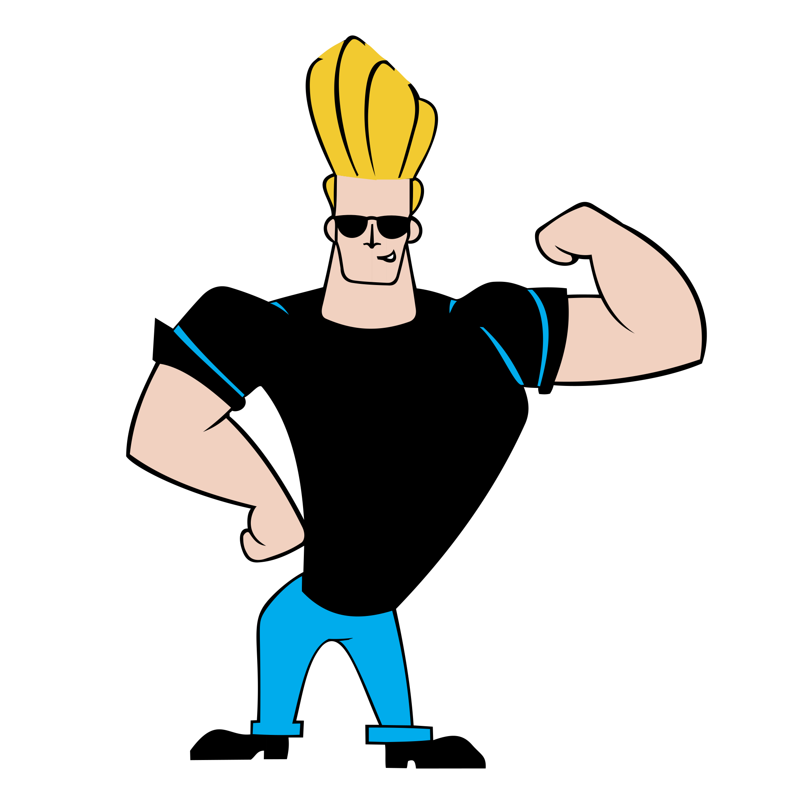

<h1 align="center">¡Hi!, I am Jonathan Viera👋</h1>

  
   &nbsp;
    
     &nbsp;

  ¡Welcome to my GitHub profile! I am a Full Stack JavaScript Development, passionate about technology and sharing knowledge with the community.

   
  
🛠️ Skills and Technologies

     
  👨🏽‍💻Operating Systems and Productivity Software:
      
     
    &nbsp;
     &nbsp;
     &nbsp;    

  👨🏽‍💻Development Languages:
   
 &nbsp;
 &nbsp;
 &nbsp; &nbsp;
 &nbsp; &nbsp; 

  👨🏽‍💻Libraries, Framekorks and Developer Tools:

   &nbsp; &nbsp; 
     &nbsp; &nbsp; 
     &nbsp; &nbsp; 
     &nbsp; &nbsp;
     &nbsp; &nbsp;
     &nbsp;   
     &nbsp;
     &nbsp; 
     &nbsp;
     &nbsp; 
     &nbsp;
     &nbsp;
     &nbsp; &nbsp;       

  👨🏽‍💻Databases:
  
 &nbsp; &nbsp;
     &nbsp; &nbsp;  

  📫Web Development Cloud Storage:
  
 &nbsp; 
     &nbsp;
 
=======
     

  
🚀 Featured projects.

🚀[desafio-evaluado-17-base-de-datos-relacionales](https://github.com/jviera100/desafio-evaluado-17-base-de-datos-relacionales): Sql Challenge in Powershell Terminal and pdAdmin Postgre.

🚀[desafio-evaluado-16-prueba-programacion-avanzada-en-javascript](https://github.com/jviera100/desafio-evaluado-16-prueba-programacion-avanzada-en-javascript): 
Final test of module 4. I went much further giving great added value, integrating all the content to date of the first four modules, separating into 4 html pages, content such as api hero, api pokemon, videos, animals, I separated all the JavaScript code by associated html and by applied content and in CSS I did the same, separating all the style code by associated html and by content, this way there is more order, the code can be reused, errors can be handled better, I challenged myself same, using a lot of code, in a large work, with several files, which I can present in an orderly manner. The project is about a registration table, in which the data is added using a button and transferred to a table on the left showing the image and sound of the animal. Additionally, clicking on the image opens a modal window with the animal's data. Integrating Html-Css-bootstrap-Jquery-Js-Api-Ajax-Api-json-canvas-videos-promise-dynamic table-log table-robust error handling-self-executing function-callback-modules. Final test of module 3, in the latam full stack g64 challenge, here I integrated everything I had learned so far, in which I met the requirements, I went further, and integrated the option to view the pdf with a button and with a link in the navbar, the navbar buttons were fixed, and I added another pokemon api call in the navbar, also when inspecting the web page or viewing the small screen you see the hamburger button with rotation animation and alternating with image x. The super hero image has a toggle fade and slide animation when you hover the mouse over it and click, a form was made to search for hero by number with api-ajax and a canvas graphic. If I search and do not enter a number, it executes random, that is, it shows me a random hero, add a click event to the form title so that it changes color. I looked for motivational messages from heroes and put a bootstrap carousel. Below you will see an image of Captain America that has a spinning animation when you click (event) on the image and returns to its original position. On the right fontawesome icon two bootstrap tooltip buttons with alert click event. Add cards with bootstrap grid with click event hide and show text when clicking on card images. Add a form with an alert button. The footer has awesome font icons with links to social networks that open on a new website. Additionally, add explanatory comments to the codes, so that their operation is understandable.

🎓 Studies and Certifications

[Audit](Enlace al Título o Institución): Title Accountant Auditor Duoc Uc

[General accountant mention tax legislation](Enlace al Título o Institución): Title General Accountant with mention in tax legislation Duoc Uc

[Professional Driver](Enlace a la Certificación): A3 license.

[Development Full Stack JavaScript](Enlace a la Certificación): Currently taking the course.

[Basic English](Enlace a la Certificación): studying with total immersion in different applications and conversation groups.
