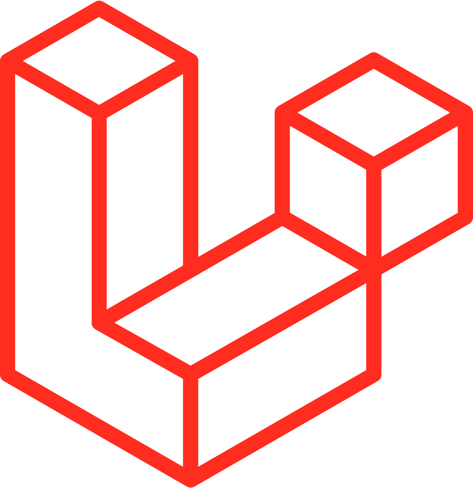
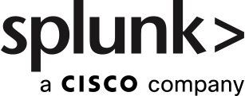

<h1 align="center">¡Hi!, I am Jonathan Viera👋</h1>

  ¡Welcome to my GitHub profile! I am a Full Stack JavaScript Development, passionate about technology.

  
 # 📌 Index of contents.

1. [ Development Languages and Tools: ](#tools)
2. [look at my project](#Authors)
3. [Resume](#Resume)
4. [Gratitude](#Gratitude)
5. [Contact](#Contact)

## Sección 1: 👨🏽‍💻 Development Languages and Tools:  

  
Sección 1:  Development Languages and Tools: 
  
    
 
         &nbsp; 
         &nbsp;           
         &nbsp;
         &nbsp;
         &nbsp; &nbsp;
         &nbsp; &nbsp;
         &nbsp; &nbsp;
         &nbsp; &nbsp;
         &nbsp; &nbsp;
         &nbsp; &nbsp;
         &nbsp; &nbsp;
         &nbsp; 
         &nbsp;
          &nbsp; &nbsp;
         &nbsp; &nbsp;       
         &nbsp; &nbsp;                 
         &nbsp; &nbsp; 
         &nbsp; &nbsp; 
         &nbsp; &nbsp; 
         &nbsp; &nbsp;
         &nbsp; &nbsp;
         &nbsp;   
         &nbsp;         
         &nbsp; 
         &nbsp;
         &nbsp;
         &nbsp; &nbsp;
         &nbsp;
         &nbsp;
         &nbsp; 
         &nbsp;   
         &nbsp; &nbsp;
         &nbsp; &nbsp;    
         &nbsp; 
         &nbsp;  
         &nbsp; &nbsp;              
         &nbsp; &nbsp;              
         &nbsp; &nbsp;              
         &nbsp; &nbsp;              
         &nbsp; &nbsp;              
         &nbsp; &nbsp;                       
    

## Sección 2: look at my project ✒️ 

  
Sección 2: Authors
 
  
  - **Jonathan Viera L** - _Initial work_ - 🚀[look at my FullStack project in GitHub](https://github.com/jviera100/m8d35Hotel)
  - **Jonathan Viera L** - _Initial work_ - 🚀[look at my FullStack project in Render](https://m8d35hotel.onrender.com)
  - **Jonathan Viera L** - _Initial work_ - 🚀[look at my database proyect in GitHub](https://github.com/jviera100/desafio-evaluado-17-base-de-datos-relacionales): Sql Challenge in Powershell Terminal and pdAdmin Postgre.
  - **Jonathan Viera L** - _Initial work_ - 🚀[look at my javaScript proyect in GitHub](https://github.com/jviera100/desafio-evaluado-16-prueba-programacion-avanzada-en-javascript): Final test integrating all learned content: HTML, CSS, Bootstrap, jQuery, JavaScript, APIs, AJAX, JSON, Canvas, videos, promises, dynamic tables, error handling, self-executing functions, callbacks, modules. Project includes registration table, modal window, PDF view, animations, form search, carousel, tooltips, social links.

⌨️ with ❤️ by [Jonathan Viera L, See my profile on GitHub](https://github.com/jviera100) 😊 

## Sección 3: Resume  🎓 

  
Sección 3: Resume 
  
    Studies and Certifications

      [Audit](Enlace al Título o Institución): Title Accountant Auditor Duoc Uc

      [General accountant mention tax legislation](Enlace al Título o Institución): Title General Accountant with mention in tax legislation Duoc Uc

      [Professional Driver](Enlace a la Certificación): A3 license.

      [Development Full Stack JavaScript](Enlace a la Certificación).

      [Basic English](Enlace a la Certificación): studying with total immersion in different applications and conversation groups.

      [Google AI Fundamentals](Enlace a la Certificación): Certification from Google.

      [Google Cybersecurity 2024](Enlace a la Certificación): Certification from Google.
  

## Sección 4: Expressions of Gratitude 🎁 

  
Sección 4: Expressions of Gratitude 
  

  I am grateful for the teaching of [Talento Digital para Chile](https://talentodigitalparachile.cl/), [Academia Desafio Latam](https://desafiolatam.com/), [freeCodeCamp](https://freecodecamp.org/) y [Coursera](https://coursera.org/). If you found any value in this project or want to contribute, here's what you can do:
    - Share this project with others
    - Invite me a tea ☕
    - Show your appreciation by saying thank you.

## Sección 5: Connect with me: 📧 

  
Sección 5: Connect with me: 
  
    
  

  <h4 >Connect with me:</h4>
  

  
  
  
  
  
  

  

