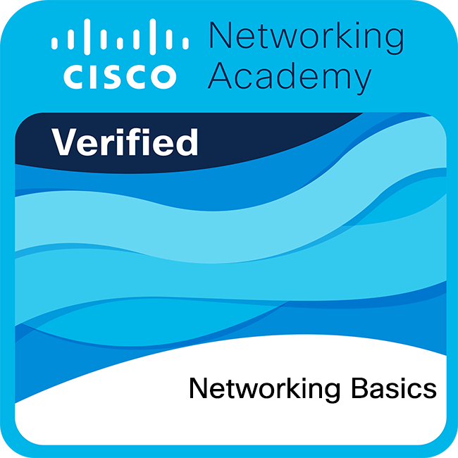
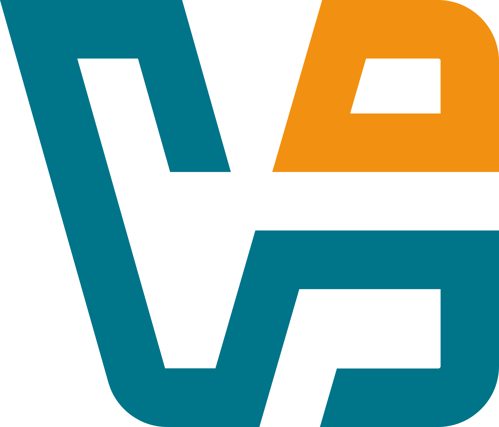

<h1 align="center">¡Hi!, I am Jonathan Viera👋</h1>

  ¡Welcome to my GitHub profile! I am a Full Stack JavaScript Development, passionate about technology.

  
 # 📌 Index of contents.

1. [ Development Languages and Tools: ](#tools)
2. [look at my project](#MyProjects)
3. [Resume](#Resume)
4. [Gratitude](#Gratitude)
5. [Contact](#Contact)

## Sección 1: 👨🏽‍💻 Development Languages and Tools:  

  
Sección 1:  Development Languages and Tools: 
  
    
 
         &nbsp; 
         &nbsp; 
         &nbsp; 
         &nbsp; 
         &nbsp; 
         &nbsp;           
         &nbsp;
         &nbsp; &nbsp;              
         &nbsp; &nbsp;              
         &nbsp; &nbsp;
         &nbsp;              
         &nbsp; &nbsp;              
         &nbsp; &nbsp;              
         &nbsp; &nbsp;              
         &nbsp; &nbsp;              
         &nbsp; &nbsp;
         &nbsp; &nbsp;  
         &nbsp; &nbsp;
         &nbsp; &nbsp;
         &nbsp;
         &nbsp;
         &nbsp;
         &nbsp; &nbsp;            
         &nbsp; &nbsp;            
         &nbsp;
         &nbsp;
         &nbsp; &nbsp;       
         &nbsp; &nbsp;
         &nbsp; &nbsp;
         &nbsp; &nbsp;
         &nbsp; &nbsp;
         &nbsp; &nbsp;
         &nbsp; &nbsp;
         &nbsp; &nbsp;
         &nbsp; &nbsp;
         &nbsp; 
         &nbsp;
          &nbsp; &nbsp;
         &nbsp; &nbsp;       
         &nbsp; &nbsp;                 
         &nbsp; &nbsp; 
         &nbsp; &nbsp; 
         &nbsp; &nbsp;
         &nbsp; &nbsp; 
         &nbsp; &nbsp;
         &nbsp; &nbsp;
         &nbsp;   
         &nbsp;  
         &nbsp;       
         &nbsp;         
         &nbsp;                 
         &nbsp;            
         &nbsp;        
         &nbsp; &nbsp;
         &nbsp; &nbsp;                                
    

## Sección 2: Mis Proyectos Destacados ✒️ 

  
Sección 2: Proyectos Destacados (por Jonathan Viera L)

  - **🌟 Documentación Multidisciplinaria en GitHub** - 🚀 [Explora mi Guía Completa](https://github.com/jviera100/documentacion)
    - _Mi proyecto más destacado y al que más tiempo he dedicado._ Un compendio exhaustivo y proyecto personal que compila guías, apuntes y recursos sobre un espectro increíblemente amplio de tecnologías. Abarca desde **desarrollo web FullStack** (HTML, CSS, Bootstrap, JavaScript, jQuery, Node.js, Express, React, PHP, Laravel, Vite, Babel, JSON), **bases de datos y SQL**, hasta **sistemas operativos** (Linux, Terminal), **control de versiones** (Git), y **Python** para diversas aplicaciones.
    - Profundiza en **análisis y ciencia de datos** (Python Data Analyst, Data Science, Power BI), **plataformas cloud** (Azure, Google Cloud), **virtualización** (VirtualBox), **networking y ciberseguridad** (Cisco, Wireshark, tcpdump, Suricata, Splunk, Chronicle), e incluso **desarrollo de juegos** con Phaser y **herramientas de IA para el empleo**.
    - El objetivo es proporcionar un recurso práctico y centralizado para el aprendizaje y la aplicación de estas tecnologías, demostrando mi pasión por la documentación clara, el aprendizaje continuo y la exploración de la diversidad del panorama tecnológico.
  - **FullStack Hotel Project** - _Trabajo inicial_ - 🚀 [Ver en GitHub (Repositorio Privado)](https://github.com/jviera100/m8d35Hotel)
    - *Nota: Este es un repositorio privado. Por favor, contáctame para solicitar acceso o para que te comparta la carpeta del proyecto.*
  - **Desafío Base de Datos Relacionales** - _Trabajo inicial_ - 🚀 [Ver proyecto de base de datos en GitHub](https://github.com/jviera100/desafio-evaluado-17-base-de-datos-relacionales)
    - Desafío SQL ejecutado en Terminal Powershell y pgAdmin PostgreSQL.
  - **Prueba Programación Avanzada en JavaScript** - _Trabajo inicial_ - 🚀 [Ver proyecto de JavaScript en GitHub](https://github.com/jviera100/desafio-evaluado-16-prueba-programacion-avanzada-en-javascript)
    - Prueba final integrando HTML, CSS, Bootstrap, jQuery, JavaScript, APIs, AJAX, JSON, Canvas, videos, promesas, tablas dinámicas, manejo de errores, funciones autoejecutables, callbacks, módulos. Incluye tabla de registro, ventana modal, vista PDF, animaciones, búsqueda en formulario, carrusel, tooltips, enlaces sociales.

⌨️ con ❤️ por [Jonathan Viera L, Mira mi perfil en GitHub](https://github.com/jviera100) 😊

## Sección 3: Resumen Profesional y Enfoque Actual 🎓 

  
Sección 3: Resumen Profesional y Enfoque Actual

  Partiendo de una base en Desarrollo Full Stack JavaScript y con certificaciones como Google Cybersecurity, mi enfoque profesional actual se ha consolidado firmemente en el **desarrollo activo de competencias en ciberseguridad**.

  Estoy invirtiendo significativamente en mi preparación para certificaciones clave de la industria (como la ruta de Cisco hacia Técnico en Redes y Analista de Ciberseguridad Junior) y en la ejecución de proyectos prácticos. Esto incluye mi experiencia en la implementación y configuración de entornos virtualizados (Kali Linux, Ubuntu en VirtualBox) para realizar pruebas de seguridad, análisis básico de vulnerabilidades y la familiarización con herramientas de diagnóstico de red (ej. Wireshark, Packet Tracer).

  Mi objetivo es la adquisición continua de conocimiento teórico y práctico en ciberseguridad, con la meta de aplicar y expandir estas habilidades fundamentales en un rol inicial, aportando una sólida base técnica y una mentalidad de aprendizaje constante.

## Sección 4: Expresiones de Gratitud 🎁 

  
Sección 4: Expresiones de Gratitud

  Estoy profundamente agradecido por la enseñanza, los recursos y las oportunidades de aprendizaje proporcionadas por:
  - [Academia Desafío Latam](https://desafiolatam.com/)
  - [Cisco Networking Academy (NetAcad)](https://www.netacad.com/)
  - [Coursera](https://coursera.org/)
  - [freeCodeCamp](https://freecodecamp.org/)
  - [Jóvenes Programadores (BiblioRedes)](https://www.jovenesprogramadores.cl/)
  - [Microsoft Learn](https://learn.microsoft.com/)
  - [Santander Open Academy](https://sso.santanderopenacademy.com/)
  - [Talento Digital para Chile](https://talentodigitalparachile.cl/)

  Si encontraste algún valor en mis proyectos o quieres contribuir de alguna manera, aquí tienes algunas ideas:
    - Comparte mis proyectos con otros.
    - Invítame un té ☕ o un café ☕.
    - Muestra tu aprecio con un simple "gracias".

## Sección 5: Connect with me: 📧 

  
Sección 5: Connect with me: 

  

  <h4 >Connect with me:</h4>
  

  
  
  
  

  

  

