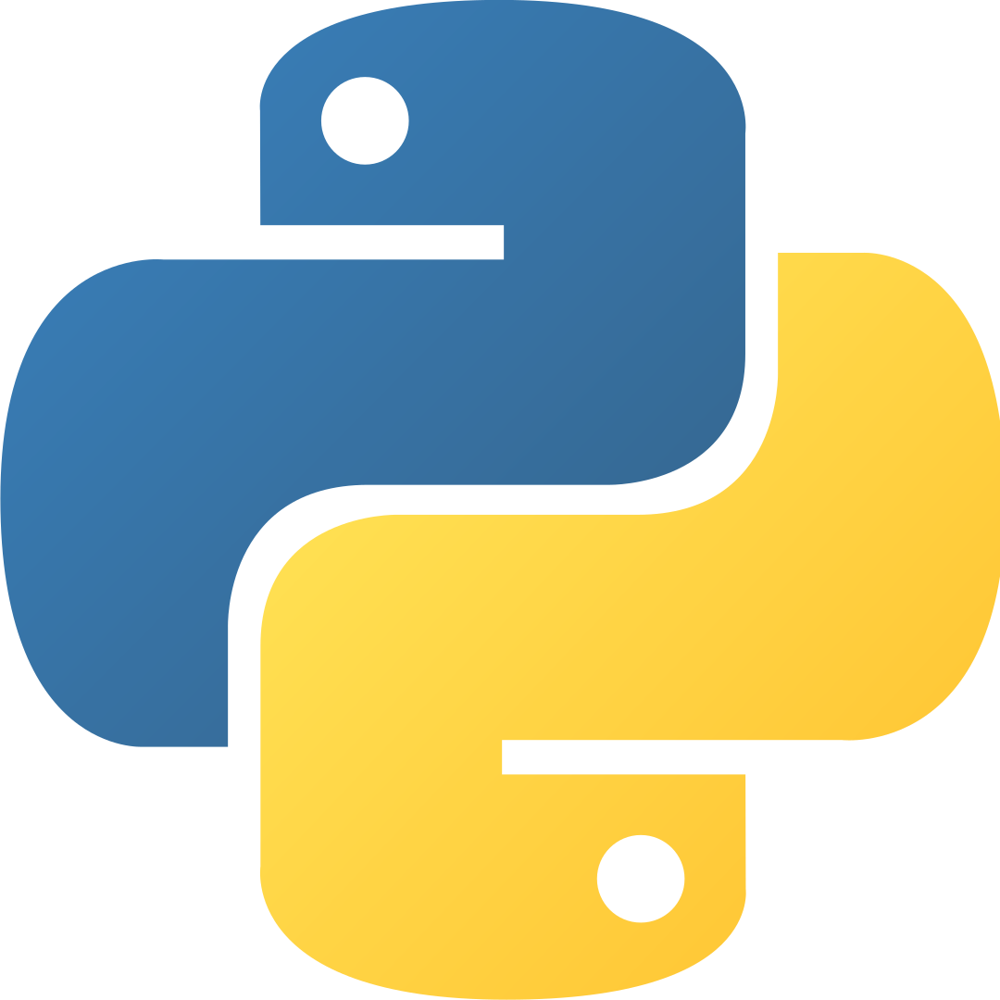
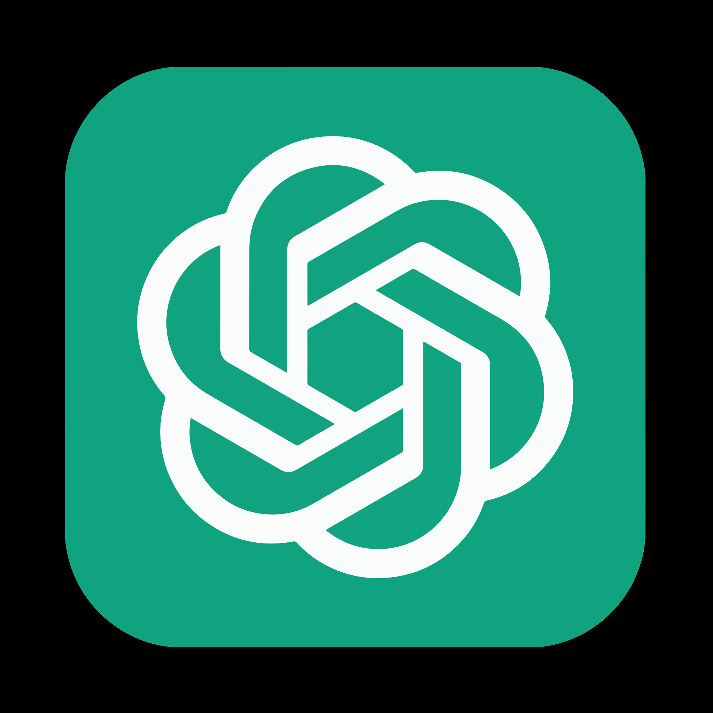

<h1 align="center">¡Hi!, I am Jonathan Viera👋</h1>

  ¡Welcome to my GitHub profile! I am a Full Stack JavaScript Development, passionate about technology.

  
 # 📌 Index of contents.

1. [Gratitude](#Gratitude)
2. [Authors and look at my project in Render](#Authors)
3. [ Development Languages and Tools: ](#tools)

## Sección 8: Expressions of Gratitude 🎁 

  
Sección 8: Expressions of Gratitude 
  

  I am grateful for the teaching of [Talento Digital Chile](https://talentodigitalparachile.cl/), [Academia Latam](https://desafiolatam.com/), [freeCodeCamp](https://freecodecamp.org/) y [Coursera](https://coursera.org/). If you found any value in this project or want to contribute, here's what you can do:
    - Share this project with others
    - Invite me a tea ☕
    - Show your appreciation by saying thank you.

## Sección 10: Authors and look at my project in Render ✒️ 

  
Sección 10: Authors
 
  
  - **Jonathan Viera L** - _Initial work_ - [look at my project in GitHub](https://github.com/jviera100/m8d35Hotel)
  - **Jonathan Viera L** - _Initial work_ - [look at my project in Render](https://m8d35hotel.onrender.com)

⌨️ with ❤️ by [Jonathan Viera L, See my profile on GitHub](https://github.com/jviera100) 😊 

## Sección 3: 👨🏽‍💻 Development Languages and Tools:  

  
Sección 3:  👨🏽‍💻Development Languages and Tools: 
  
    
           
         &nbsp;
         &nbsp;
         &nbsp; &nbsp;
         &nbsp; &nbsp;
         &nbsp; &nbsp; 
         &nbsp; &nbsp; 
         &nbsp; &nbsp; 
         &nbsp; &nbsp; 
         &nbsp; &nbsp; 
         &nbsp; &nbsp;
         &nbsp; &nbsp;
         &nbsp;   
         &nbsp;
         &nbsp; 
         &nbsp;
         &nbsp; 
         &nbsp;
         &nbsp;
         &nbsp; &nbsp;
         &nbsp;
         &nbsp;
         &nbsp; 
         &nbsp;   
         &nbsp; &nbsp;
         &nbsp; &nbsp;    
         &nbsp; 
         &nbsp;
    

#-------------------------------------------------------------

  
🚀 Featured projects.

🚀[desafio-evaluado-17-base-de-datos-relacionales](https://github.com/jviera100/desafio-evaluado-17-base-de-datos-relacionales): Sql Challenge in Powershell Terminal and pdAdmin Postgre.

🚀[desafio-evaluado-16-prueba-programacion-avanzada-en-javascript](https://github.com/jviera100/desafio-evaluado-16-prueba-programacion-avanzada-en-javascript): Final test integrating all learned content: HTML, CSS, Bootstrap, jQuery, JavaScript, APIs, AJAX, JSON, Canvas, videos, promises, dynamic tables, error handling, self-executing functions, callbacks, modules. Project includes registration table, modal window, PDF view, animations, form search, carousel, tooltips, social links.

🎓 Studies and Certifications

[Audit](Enlace al Título o Institución): Title Accountant Auditor Duoc Uc

[General accountant mention tax legislation](Enlace al Título o Institución): Title General Accountant with mention in tax legislation Duoc Uc

[Professional Driver](Enlace a la Certificación): A3 license.

[Development Full Stack JavaScript](Enlace a la Certificación).

[Basic English](Enlace a la Certificación): studying with total immersion in different applications and conversation groups.
